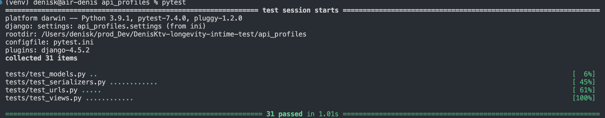
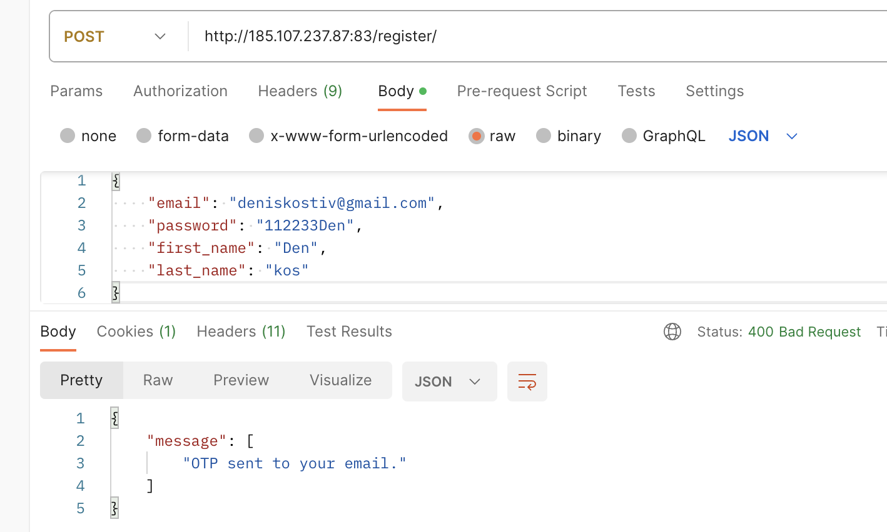
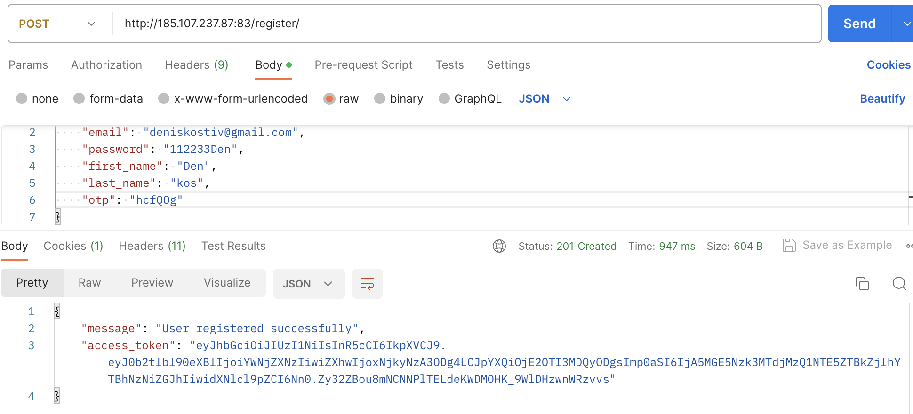
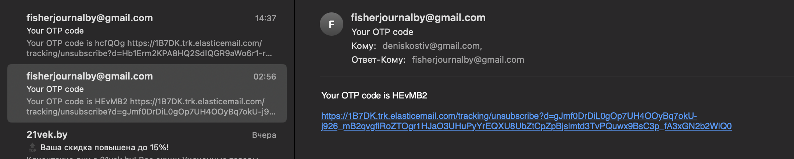
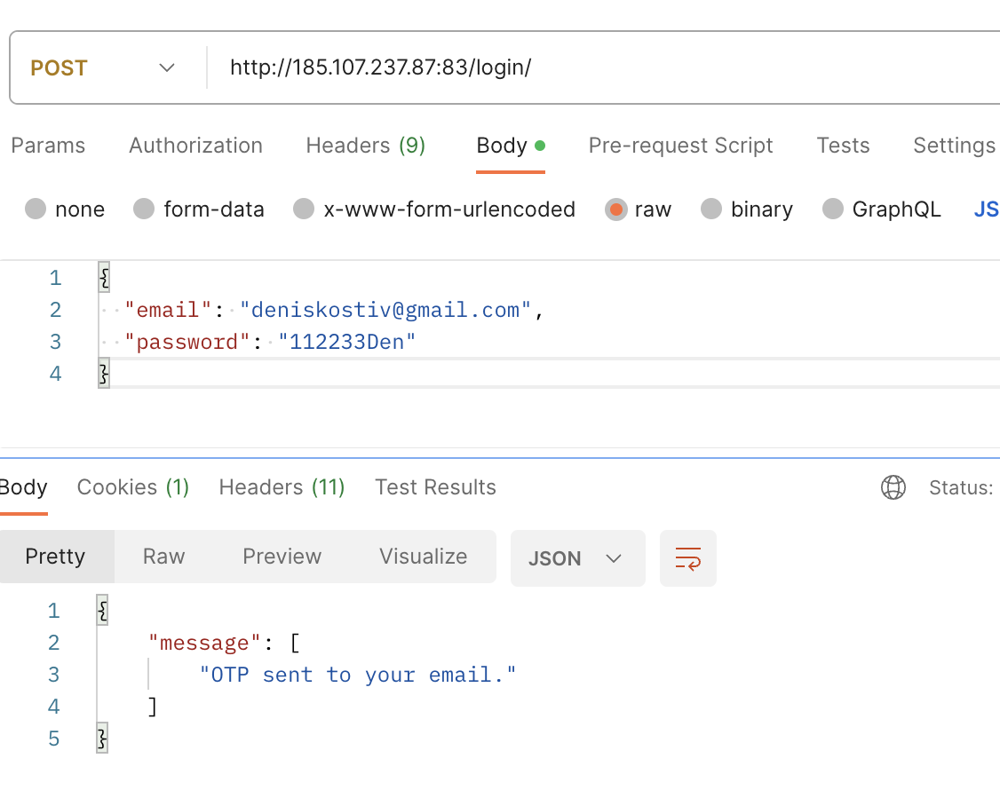
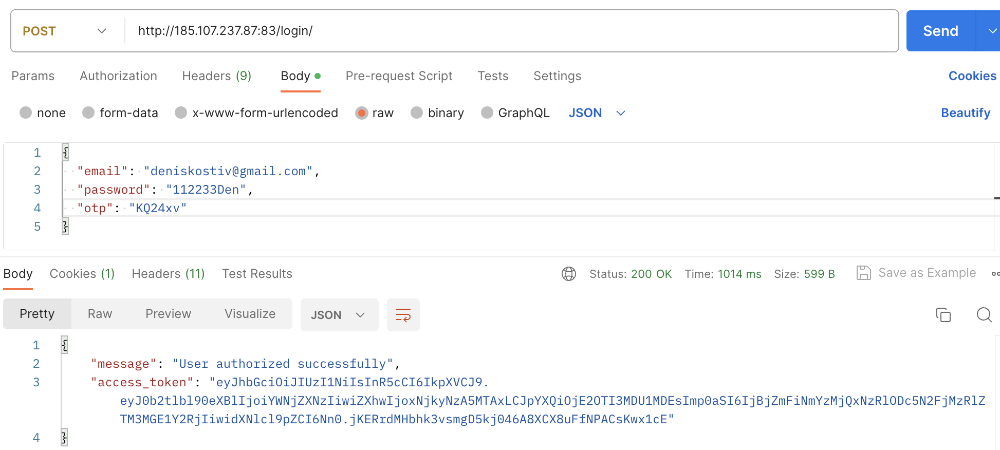
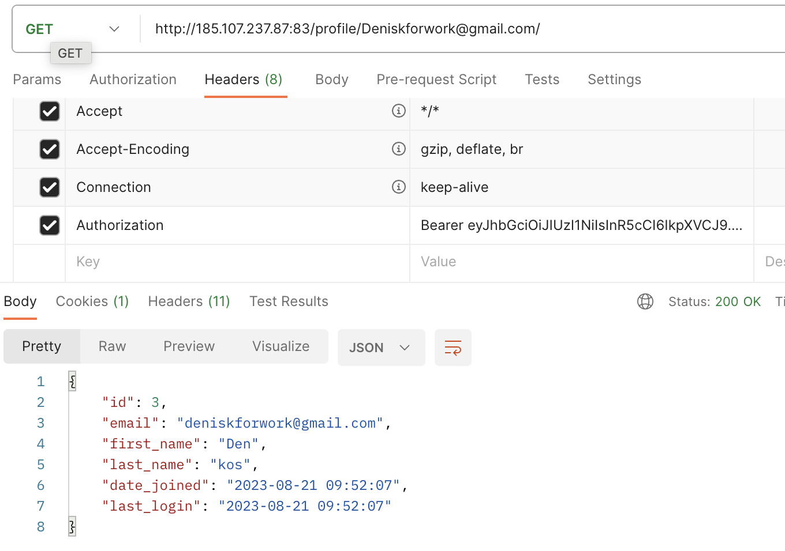
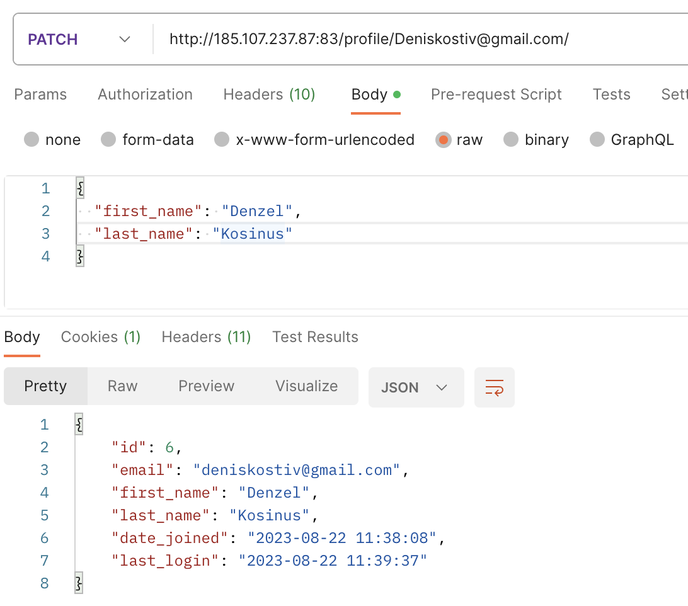
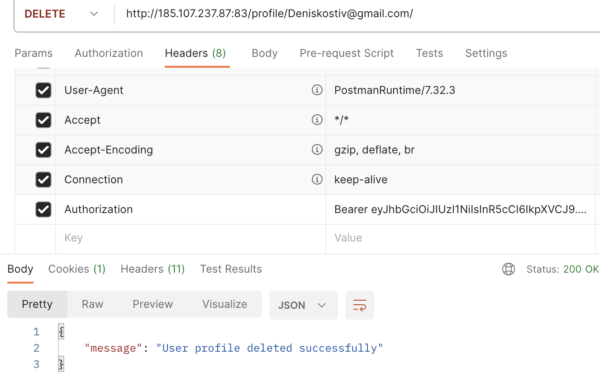

# Task-Backend-1
# DenisKtv-longevity-intime-test - API

  

## Technology Stack

[](https://www.python.org/)
[](https://www.djangoproject.com/)
[](https://www.django-rest-framework.org/)
[](https://www.postgresql.org/)
[](https://celeryproject.org/)
[](https://redis.io/)
[](https://nginx.org/ru/)
[](https://gunicorn.org/)
[](https://www.docker.com/)
[](https://github.com/features/actions)

## Project Description

The project implements a registration and authorization mechanism using an email address. Upon successful input of data that passes validation, the system using Celery and Redis sends a 6-digit code to the specified e-mail. After successful verification of the code, the user is given a token. With its help, as an authorized user, it is possible to view profiles, modify and delete your profile.

## Installing the project locally

* Clone the repository to the local machine:
```bash
git clone https://github.com/DenisKtv/DenisKtv-longevity-intime-test.git
cd DenisKtv-longevity-intime-test/
```

* Create and activate a virtual environment:

````bash
python -m venv venv
```

```bash
. venv/bin/activate
```

* Create an `.env` file in the `/infra/` directory with the contents:

```
Django:
SECRET_KEY = 

SMTP_KEY =

Postgresql:
DB_ENGINE = 
DB_NAME = 
POSTGRES_USER = 
POSTGRES_PASSWORD = 
HOST = 
PORT = 
```

* Install dependencies from the requirements.txt file:

```bash
cd api_profiles
pip install -r requirements.txt
```

* Test run:

```bash
pytest



* Make the migrations:

```bash
python manage.py makemigrations
python manage.py migrate
```

* Run server:

```bash
python manage.py runserver
```

## Start the project in a Docker container
* Install Docker.

Startup parameters are described in `docker-compose.yml` and `nginx.conf` files which are located in `infra/` directory.  
If necessary, add/change the project addresses in the `nginx.conf` file

* Start docker-compose:
```bash
docker-compose up -d --build
```  
> After the build, 5 containers appear:
  > 1. database container **api_db**
  > 2. application container **api_backend**
  > 3. web server container **api_nginx**
  > 4. asynchronous task queue **celery**
  > 5. message broker **redis**

* Apply migrations:
```bash
docker-compose exec api_backend python manage.py migrate
```
* Create an administrator:
```bash
docker-compose exec api_backend python manage.py createsuperuser
```
* Build statics:
```bash
docker-compose exec api_backend python manage.py collectstatic --no-input

## Page for the test:
The page is available at the link:
[http://185.107.237.87:83/register/](http://185.107.237.87:83/register/)

## API Documentation:
API documentation is available at the link (created with redoc):
[http://185.107.237.87:83/redoc/](http://185.107.237.87:83/redoc/)

## Examples of requests:

### http://185.107.237.87:83/register/
 
### Receive the code by e-mail



### http://185.107.237.87:83/login/
 


### http://185.107.237.87:83/'profile/<str:email>/'
### GET can be viewed by all authorized users; for authorization in Headers in Authorization enter 'Bearer our token':

### UPDATE(put, patch) - you can only change your profile:

### DELETE - you can delete only your profile:
